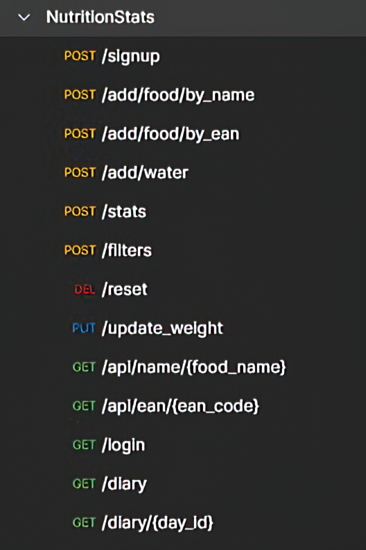
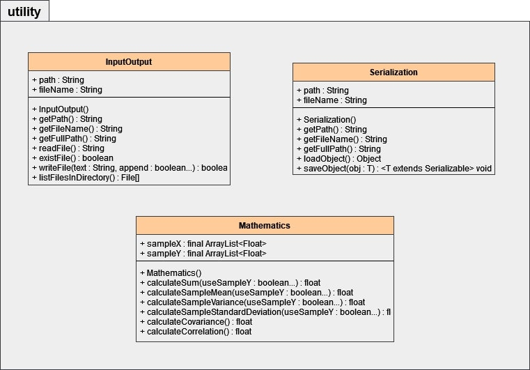
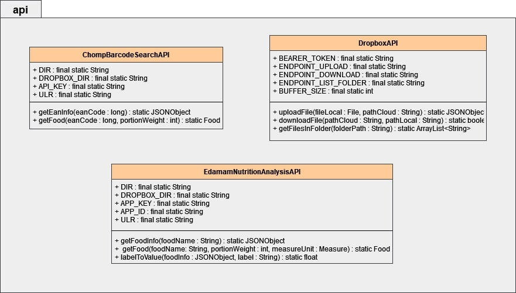
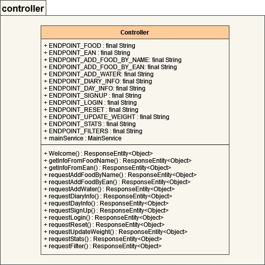
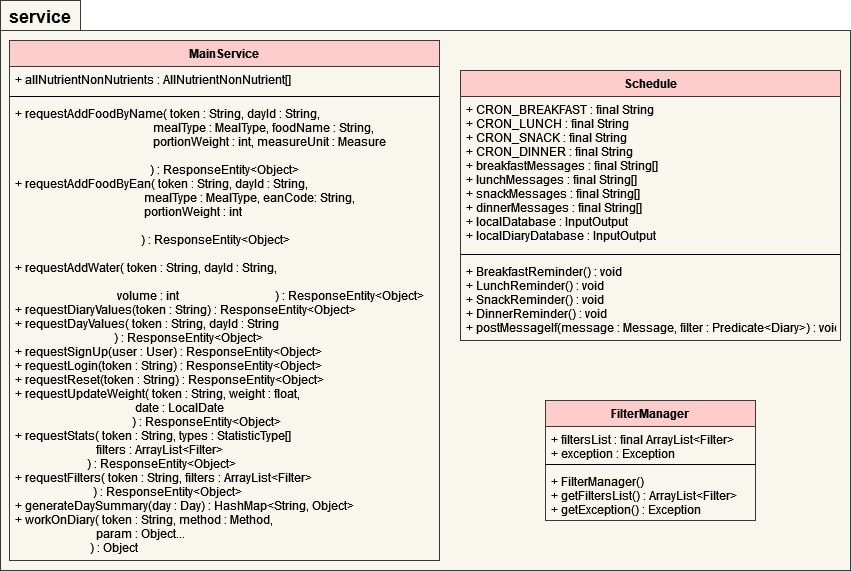

<div align="center">

 <div align="left">

# **NutritionStats**
Project made for the Object-Oriented Programming course a.a. 2021/2022
#### Note:
> The code is fully covered with a plentiful documentation (JavaDoc): (**now online**)
>
> *https://clever-mccarthy-a6b47e.netlify.app/*
----------------------------------------------------------------------------------------------------------------------------------------

***
  
<a name="index"></a>
## 📘 Index 📘

* [Access](#access)
  * [Remote access](#remote_access)
  * [Android application](#client)
* [Description](#description)
  * [Exceptions](#exceptions)
* [Endpoints](#endpoints)
* [Returned data](#data)
  * [Metadata example](#metadata_example)
  * [Statistics example](#statistics_example)
* [Uml](#uml)
  * [Packages](#uml_packages)
  * [Model](#uml_model)
  * [Nutrient](#uml_nutrient)
  * [Exception](#uml_exception)
  * [Enum](#uml_enum)
  * [Filter](#uml_filter)
  * [Statistic](#uml_statistic)
  * [Utility](#uml_utility)
  * [Api](#uml_api)
  * [Controller](#uml_controller)
  * [Service](#uml_service)
* [Used tools](#tools)
  * [Software](#tools_software)
  * [Api](#tools_api)
* [Authors](#authors)

***

<a name="access"></a>
## 💻 Access💻 <div align="right"> [📘](#index)
<a name="remote_access"></a>
### *Remote Access*

>Remote access to this rest API (***now deployed***):
>
> *https://nutritionstatsoop.herokuapp.com/*
----------------------------------------------------------------------------------------------------------------------------------------
<a name="client"></a>
### *Android application (client)*

>You can find here the client frontend made for this API (***Android application***):
>
> *https://github.com/MrPio/NutritionStats_client*
----------------------------------------------------------------------------------------------------------------------------------------

<a name="description"></a>
## 📋 Description of the Project 📋 <div align="right"> [📘](#index)
NutritionStats offer a management on nutrition data provided by the user. It can calculate statistics on a given
period of time and on a specific sector. User can use these data to find the _mean_ value of his weight, the _variance_ of
his lipid intake or the _percentage_ of proteins above macronutrients. This rest api works using Edamam's free database,
which provides nutritional values on a given food name, and stores in a model (description below).

In order to calculate useful statistics some good data are needed, so the client should register his consumptions.
This can be done by adding `Food` by its name or by its ean code to one of the following meals of each day:
- `Breakfast`
- `Lunch`
- `Snack`
- `Dinner`

The food names or the ean codes provide new instances of `Food` filled with the values of the following nutrition filtered in the response
of Edamam/Chomp api:
- `Carbohydrate`
- `Protein`
- `Lipid`
- `Vitamin A`
- `Vitamin C`
- `Sodium`
- `Calcium`
- `Potassium`
- `Iron`
- `Fiber`
- `Water`

The client can also add the quantity of water drunk daily or update the value of his weight using the dedicated endpoints.
In the end all the data can be filtered and used to calculate the following statistics:
- `Mean`
- `Variance`
- `Percentage`
- `Correlation`

Filter the data means to specify a range of days or a meal type on which calculate the statistics. In fact the client
can filter his data:
- `By date`
- `By meal type`
- `By food name`
- `By nutrient`


<a name="exceptions"></a>
### 🛑 Exceptions
Here you can find a list of all the checked exception created in this project. These exceptions are handled inside a `try/catch` block inside the controller.

Class name | Description
----| ----
`UserNotFound` | Thrown when the parameter `token` in each endpoint (except `/signup`) doesn't belong to any existing user inside the database.
`UserAlreadyInDatabase` | Thrown when the client tries to signup with an already registered email.
`EndDateBeforeStartDateException` | Thrown when the client tries to filter using a value for `start_date` grater than the value of `end_date`.
`ApiFoodNotFoundException` | Thrown when the requested `food_name`  cannot be found by Edamam api, or when the requested `ean_code` cannot be found by Chomp api. 
`ChompLimitOvercameException` | Thrown when too many request are made but cannot be handled due to free Chomp api limitation.

***

<a name="endpoints"></a>
## 🌎 Application endpoints 🌎: <div align="right"> [📘](#index)
Type | Route | Params | Body | Description
---- | ---- | ---- | ---- | ----  
🟡**POST** | `/signup` | `nickname`, `email`, `birth`, `height`, `weight`, `diet`, `gender` | -| Register new user.
🟡**POST** | `/add/food/by_name` | `token`, `day_id`, `meal_type`, `food_name`, `portion_weight`, `unit_of_measure` |- | Add consumed food to a specified meal by its name.
🟡**POST** | `/add/food/by_ean` | `token`, `day_id`, `meal_type`, `ean_code`, `portion_weight` |- | Add consumed food to a specified meal by its name.
🟡**POST** | `/add/water` | `token`, `day_id`, `portion_volume` |- | Add consumed water to a specified meal.
🟡**POST** | `/stats` | `token`, `type` | `start_date`, `end_date`, `meal_type`, `food_name`, `nutrient_name[]` | Get all the stats for the current user, you can filter the response by days range and by witch stats you need.
🟡**POST** | `/filters` | `token` | `start_date`, `end_date`, `meal_type`, `food_name`, `nutrient_name[]` | Filter metadata by what you need.
🔴**DELETE** | `/reset` | `token` |- | Deletes all data owned by the user.
🔵**PUT** | `/update_weight` | `token`, `weight` |- | Update the value of user's weight.
🟢**GET** | `/api/name/{food_name}` | `portion_weight`, `unit_of_measure` | -| Return information about food by its name.
🟢**GET** | `/api/ean/{ean_code}` | - |- | Return information about product by its ean code.
🟢**GET** | [`/login`](https://nutritionstatsoop.herokuapp.com/login?token=3959de8aeefabfa1385135fa8d03ee21) | `token`|-  | Login user, return user's info if in the database.
🟢**GET** | [`/diary`](https://nutritionstatsoop.herokuapp.com/diary?token=3959de8aeefabfa1385135fa8d03ee21) | `token` |- | Return all the data (`metadata`) owned by the user.
🟢**GET** | [`/diary/{day_id}`](https://nutritionstatsoop.herokuapp.com/diary/23-12-2021?token=3959de8aeefabfa1385135fa8d03ee21) | `token` | -| Return the data of the user in specified day.

***

<a name="data"></a>
## ⚙️ Returned data ⚙️: <div align="right"> [📘](#index)
<a name="metadata_example"></a>
In order to test the beaviour of all the endpoints, we used Postman, where we created a collection of all the routes.
  
  
Here follow two examples of these requests:
  ###Metadata example:
 Calling the endpoint `/diary` or `/diary/{day_id}` you can retrieve all the metadata owned by your account. These data
will be returned formatted with JSON standard, as you can see in the example below.

```
{
    "diary": {
        "user": {
            "nickname": "Valerio_Morelli",
            "email": "valeriomorelli50@gmail.com",
            "diet": "CLASSIC",
            "gender": "MALE",
            "height": 180,
            "weight": { ... },
            "mailBox": { ... },
            "yearOfBirth": "2001-06-07",
            "dailyCaloricIntake": 3300
        },
        "dayList": [
            {
                "date": "2022-01-16",
                "mealList": [
                    {
                        "mealType": "LUNCH",
                        "foodList": [
                            {
                                "name": "melon",
                                "portionWeight": 86,
                                "measure": "GR",
                                "diet": "VEGAN",
                                "nutrientList": [ ... ],
                                "notNutrientList": [ ... ],
                                "totalCalories": 32
                            },
                            ...
                        ],
                        "totalCalories": 37
                    }
                    ...
                ],
                "waterList": [ ... ],
                "sumValues": {
                    "FIBER": 0.891,
                    "PROTEIN": 0.8316,
                    "WATER_FROM_FOOD": 89.2485,
                    "CALCIUM": 0.00891,
                    "CARBOHYDRATE": 8.0784,
                    "SODIUM": 0.015840001,
                    "POTASSIUM": 0.26433,
                    "LIPID": 0.1881,
                    "VITAMIN_C": 0.036333002,
                    "VITAMIN_A": 1.6730999E-4,
                    "IRON": 2.0790001E-4
                },
                "totalCalories": 37.0
            } 
            ...
        ],
        "sumValues": {
            "FIBER": 1.665,
            "PROTEIN": 6.2790003,
            "WATER_FROM_FOOD": 171.6015,
            "CALCIUM": 0.049050003,
            "CARBOHYDRATE": 74.369995,
            "SODIUM": 0.3374,
            "POTASSIUM": 0.62804997,
            "LIPID": 20.223501,
            "VITAMIN_C": 0.068795,
            "VITAMIN_A": 3.3064996E-4,
            "IRON": 0.0028005
        },
        "totalCalories": 503.0
    }
}
```

Of course, as explained, all this metadata can be filtered using the `/filters` endpoint.
<a name="statistics_example"></a>
###Statistics example:
Then you can call the endpoint `/stats` to calculate the statistics on your filtered metadata, here
you can see an example of response.
```
{
    "result": "success",
    "MEAN": {
        "statsValues": {
            "VITAMIN_C": 0.0343975,
            "PROTEIN": 3.1395001,
            "WATER_FROM_FOOD": 85.80075,
            "LIPID": 10.111751,
            "CARBOHYDRATE": 37.184998,
            "CALCIUM": 0.024525002,
            "POTASSIUM": 0.31402498,
            "FIBER": 0.8325,
            "VITAMIN_A": 1.6532498E-4,
            "SODIUM": 0.1687,
            "IRON": 0.00140025
        },
        "calories": 251.5,
        "weight": 83.9285
    },
    "STANDARD_DEVIATION": {
        "statsValues": {
            "VITAMIN_C": 0.0027372113,
            "PROTEIN": 3.2638636,
            "WATER_FROM_FOOD": 4.875855,
            "LIPID": 14.034161,
            "CARBOHYDRATE": 41.162945,
            "CALCIUM": 0.022082947,
            "POTASSIUM": 0.070279345,
            "FIBER": 0.082731485,
            "VITAMIN_A": 2.8072209E-6,
            "SODIUM": 0.21617667,
            "IRON": 0.0016862374
        },
        "calories": 303.34882,
        "weight": 39.15111
    },
    "PERCENTAGE": {
        "statsValues": {
            "PROTEIN": 4.993241,
            "LIPID": 36.18519,
            "CARBOHYDRATE": 59.141148
        }
    }
    "CORRELATION": {
        "correlation": 0.5375776
    },
}
```
***
<a name="uml"></a>
## ☀ Application UML ☀: <div align="right"> [📘](#index)
<a name="uml_packages"></a>
### •🔰 PACKAGES:


<a name="uml_model"></a>
### •🟥 Model:


<a name="uml_nutrient"></a>
### •🟧 Nutrient:


<a name="uml_exception"></a>
### •🟨 Exception:


<a name="uml_enum"></a>
### •🟩 Enum:


<a name="uml_filter"></a>
### •🟦 Filter:


<a name="uml_statistic"></a>
### •🟪 Statistic:


<a name="uml_utility"></a>
### •🟫 Utility:


<a name="uml_api"></a>
### •⬛ Api:
    
  
<a name="uml_controller"></a>
### •⬜ Controller:
    

<a name="uml_service"></a>
### •🟥 Service:
    
  
***

<a name="tools"></a>
## 🛠️ Used tools 🛠️ <div align="right"> [📘](#index)
<a name="tools_software"></a>
- ###### Software:

  - [Eclipse](https://www.eclipse.org/) - java IDE

  - [InteelliJ IDEA](https://www.jetbrains.com/idea/) - java IDE

  - [SpringBoot](https://spring.io/projects/spring-boot) - open source Java-based framework used to create a micro Service.

  - [PostMan](https://www.postman.com) - API platform for building and using APIs.

  - [Maven](https://maven.apache.org/) - Software project management and comprehension tool based on the concept of project object model (POM).

  - [Draw.io](https://app.diagrams.net/) - Diagram software used for UML

<a name="software_api"></a>
- ###### External REST API:

  - [Edamam](https://developer.edamam.com/) - First food and nutrition database API.

  - [Chomp](https://chompthis.com/api/) - Second food and nutrition database API.

  - [Dropbox](https://www.dropbox.com/developers/documentation/http/documentation) - Storage cloud used to backup the serialized objects.

***

<a name="authors"></a>
## 👥 Authors 👥 <div align="right"> [📘](#index)
Name | Email | Github profile |
--|--|--|
Morelli Valerio|valeriomorelli50@gmail.com|[GitHub](https://github.com/MrPio)
Mazzatenta Davide|mazzada2001@gmail.com|[GitHub](https://github.com/Paccise)
