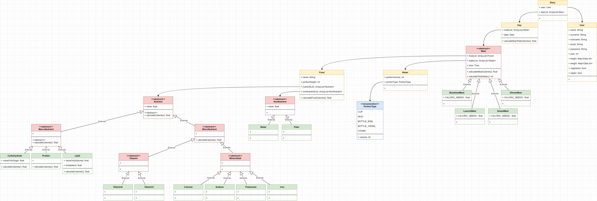

# NutritionStats
Project made for the Object-Oriented Programming course a.a. 2021/2022

>Remote access to this rest API: (***still not deployed***)
> *https://nutritionstatsoop.herokuapp.com/*
> 
----------------------------------------------------------------------------------------------------------------------------------------

## Application Route 🌎:
Type | Route | Params | Description
---- | ---- | ---- | ----  
POST | **/add/food** | day, meal| Add consumed food.
POST | **/add/meal** | day| Add an entire meal (list of foods).
GET | **/diary** | | Return all the data owned by the user.
GET | **/diary/{day_id}** | | Return the data of the user in specified day.
GET | **/stats** | | Get all the stats for the current user, you can filter the response by days range and by witch stats you need.

## Application UML ☀:
###Model:
